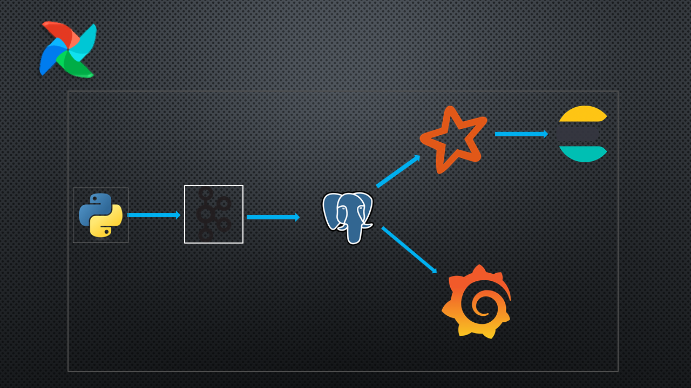

# 📊 Search Advertise Data Pipeline

## 📌 Overview

This project implements a sophisticated data pipeline that automates the collection, processing, and analysis of search advertisement data from the Bama website. Utilizing a stack of high-performance technologies such as Apache Airflow, Apache Kafka, PostgreSQL, Apache Spark, Elasticsearch, and Grafana, this system is fully dockerized to ensure smooth deployment and scalability.

## 🛠️ Technology Stack

| Technology      | Description                                              |
|-----------------|----------------------------------------------------------|
| **Python**      | Used for scripting data collection and manipulation.     |
| **Apache Airflow** | Manages automation and scheduling of the pipeline tasks. |
| **Apache Kafka**   | Handles real-time data streaming.                        |
| **PostgreSQL**     | Primary database for data storage.                       |
| **Apache Spark**   | Performs data analysis and metric computation.           |
| **Elasticsearch**  | Enables efficient data searching and indexing.           |
| **Grafana**        | Visualizes data through interactive dashboards.          |
| **Docker**         | Containers ensure a consistent environment across setups.|

## 🌐 Pipeline Architecture

### 🔄 Data Collection
- **Automation**: Data is fetched from Bama via Python scripts managed by Airflow.

### 📊 Data Streaming and Storage
- **Kafka**: Data is published to topics and then moved into PostgreSQL for storage.

### 🔄 Data Processing
- **Views and Clicks**: Airflow processes ad data, sending it back to Kafka, and from there into Elasticsearch.

### 🧮 Data Analysis
- **Spark**: Computes click-through rates (CTR) and other metrics, stores in Elasticsearch sorted by these metrics.

### 📈 Visualization
- **Grafana**: Provides real-time dashboard visualizations of data and metrics.

## 🔧 Setup and Running Instructions

### Prerequisites
Ensure Docker and Docker Compose are installed on your machine.

### 🚀 Installation

1. **Clone the Repository:**
   ```bash
   git clone [your-repository-url]
   cd [project-directory]

2. **Build Docker Containers:**
   ```bash
   docker compose up -d --build

Operational Guide

1. Initiate Airflow:
   - Access the Airflow interface at http://localhost:8080.
   - Start the initial data collection DAG.

2. Monitoring Tools:
   - Kafka: Monitor the flow through topics.
   - PostgreSQL: Check data storage.
   - Elasticsearch: Ensure data is indexed correctly.
   - Grafana: View dashboards at http://localhost:3000.


2. **Shutting Down Containers:**
   ```bash
   docker compose down --volumes --remove-orphans


Operational Guide

1. Initiate Airflow:
   - Access the Airflow interface at http://localhost:8080.
   - Start the initial data collection DAG.

2. Monitoring Tools:
   - Kafka: Monitor the flow through topics.
   - PostgreSQL: Check data storage.
   - Elasticsearch: Ensure data is indexed correctly.
   - Grafana: View dashboards at http://localhost:3000.

After Project Setup

Configure an SSH connection in Airflow for Spark tasks:

1. Go to the Airflow web interface.
2. From the navbar, select Admin and click on Connections.
3. On the next page, click the + button to create a new connection.
4. Fill in the connection details as follows:
   - Connection Id: ssh_spark
   - Connection Type: SSH
   - Host: da-spark-worker
   - Username: spark_user
   - Extra: {"key_file": "/home/airflow/.ssh/id_ecdsa"}
5. Save the changes.

Set up the Grafana dashboard:

1. Go to the Grafana web interface and log in.
2. Click on Dashboards, then select the New button.
3. Click on Import.
4. From the project folder, navigate to the provisioning/dashboards directory.
5. Select the 'Advertise Dashboard' file to import.


